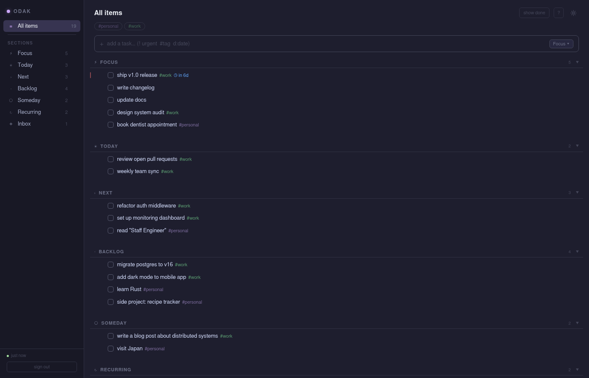
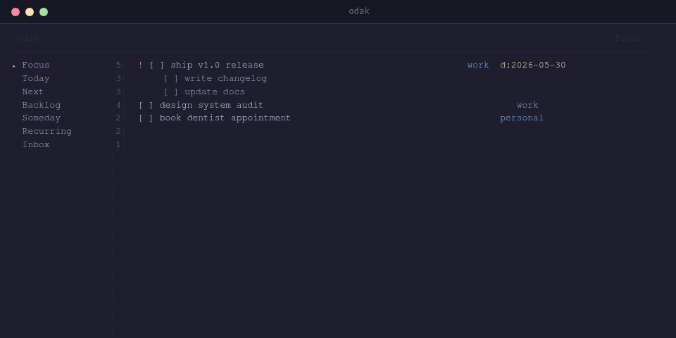

# odak

**The world's fastest todo app.**

A personal todo service backed by a plain Markdown file. Every action — toggle, edit, add, delete — reflects instantly in the UI with no perceived latency. Changes to the file from any text editor propagate to all open clients in ~200ms via WebSocket. No database, no sync delay, no cloud.

Comes with a REST API, a real-time web UI, and a terminal interface — all reading from and writing to a single `.md` file.

```
## Focus
- [ ] ship the thing [t:work] [d:2026-05-25]
    - [ ] write tests
- [x] design review

## Inbox
- [ ] [!] call the doctor
```



---

## Installation

```sh
go install github.com/zcag/odak@latest
```

Installs the full binary — CLI, TUI, and REST server with embedded web UI. Point the client at a running server via env vars or `~/.config/odak/client`:

```sh
# env vars
export ODAK_ENDPOINT=http://your-server:8761
export ODAK_TOKEN=your-api-key

# or config file (~/.config/odak/client)
endpoint=http://your-server:8761
token=your-api-key
```

### Build from source

```sh
git clone https://github.com/zcag/odak
cd odak
make build        # local binary → ~/.local/bin/odak
make deploy       # cross-compile + push to server via rsync + systemd restart
```

---

## Server

```sh
odak --server \
  --file ~/todos.md \
  --api-key secret \
  --user admin \
  --password secret \
  --port 8761 \
  --ui              # serve the web UI at /
```

Or via environment variables:

```sh
export ODAK_FILE=~/todos.md
export ODAK_API_KEY=secret
export ODAK_USER=admin
export ODAK_PASSWORD=secret
odak --server --ui
```

A `systemd` user service template is included at `deploy/odak.service.template`.

---

## Web UI

Access at `http://your-server:8761`. Changes sync in real time via WebSocket — editing the Markdown file directly also reflects instantly in all open browsers.

**Sections** — items are grouped into named sections (Focus, Today, Next, Backlog, Someday, Recurring, Inbox). Sections collapse in the sidebar and in the main view.

**Themes** — 8 dark themes (Void, Carbon, Smoke, Midnight, Nord, Catppuccin, Gruvbox, Dracula) and 8 light themes. Hover the sun/moon icon to pick.

**Keyboard shortcuts**

| Key | Action |
|-----|--------|
| `j` / `↓` | focus next item |
| `k` / `↑` | focus previous item |
| `x` | toggle done |
| `e` | edit text |
| `d` | delete |
| `n` / `/` | focus add bar |
| `w` | toggle `#work` filter |
| `p` | toggle `#personal` filter |
| `r` | refresh |
| `?` | keyboard shortcut overlay |
| `Esc` | clear focus / close |

**Drag and drop** — reorder items within a section or drag to a different section header to move them.

**Sub-items** — child items are shown indented under their parent, collapsed by default. Click the `▶` indicator to expand.

---

## Terminal UI

```sh
odak           # launch TUI (auto-detected when stdout is a TTY)
odak tui       # explicit
```

Navigate sections with arrow keys, toggle done with `x`, edit with `e`, hide completed with `h`.



---

## CLI

```sh
odak list [section]                          # list todos
odak list --tag work                         # filter by tag
odak add "review PR" --section Next          # add item
odak add "! urgent thing #work d:2026-05-25" # with flags inline
odak done <id>                               # toggle done
odak rm <id>                                 # delete
odak move <id> Today                         # move to section
odak show <id>                               # show details
```

---

## File format

Standard Markdown task lists, grouped by `##` headings. Extra metadata lives in inline tags:

```markdown
## Focus
- [ ] [!] urgent item
- [ ] [t:work] [t:personal] tagged item
- [ ] [d:2026-05-25] item with deadline
- [ ] [w:2026-06-01] item with trigger/wait date
- [ ] parent item
    - [ ] child item (indented with 4 spaces or tab)
- [x] completed item
```

The file is the source of truth — edit it directly and all clients update within ~200ms.

---

## MCP Server

Use odak as a tool inside Claude Code or any MCP-compatible AI client.

```sh
odak mcp   # start MCP server (stdio / JSON-RPC 2.0)
```

Add to `~/.claude/.mcp.json`:

```json
{
  "mcpServers": {
    "odak": {
      "command": "odak",
      "args": ["mcp"]
    }
  }
}
```

The server reads client config from the same env vars / `~/.config/odak/client` file as the CLI. Available tools:

| Tool | Description |
|------|-------------|
| `list_todos` | List items, optionally filtered by `section` or `tag` |
| `add_todo` | Add item with optional `section`, `tags`, `urgent`, `deadline` |
| `toggle_done` | Toggle done state by `id` |
| `delete_todo` | Delete item by `id` |
| `move_todo` | Move item to a different section |
| `list_sections` | List sections with item counts |

---

## Raw API

All endpoints require `Authorization: Bearer <api-key>`.

```
GET    /todos              list items (?section=, ?tag=, ?parent_id=)
POST   /todos              create item
GET    /todos/:id          get item
PATCH  /todos/:id          update item
DELETE /todos/:id          delete item
PATCH  /todos/:id/done     toggle done
POST   /todos/:id/move     move to section
POST   /todos/reorder      reorder within section
GET    /sections           list sections with counts
GET    /raw                raw markdown
PUT    /raw                overwrite markdown
GET    /ws                 WebSocket (?token=)
```
